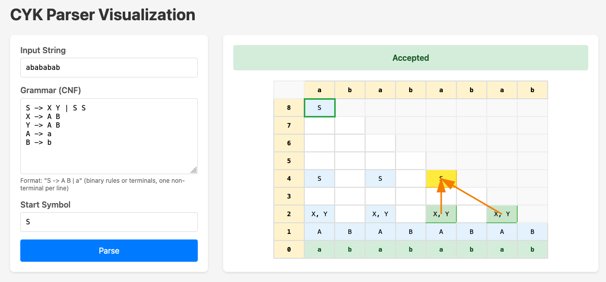
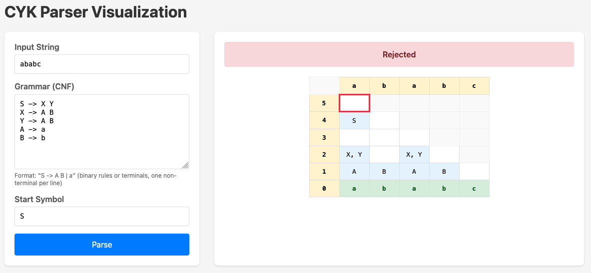

# CYK Algorithm Implementation

_This is a side-project I made while studying for my theoretical CS exam._

The **CYK (Cocke-Younger-Kasami) algorithm** is a dynamic programming algorithm used to determine whether a given string can be generated by a context-free grammar in Chomsky Normal Form (CNF).

## Usage

`uv sync` install dependencies

`uv run app.py` run app

## Showcase

This web-based visualization tool displays the CYK parsing table and lets you interactively explore how each nonterminal is derived. 
Click any cell to see arrows pointing from its source cells, visually tracing the derivation path from input tokens up through the parse tree. 
The color-coded highlighting shows the clicked cell in yellow and its source cells in green, making it easy to understand the bottom-up construction of the parse.

